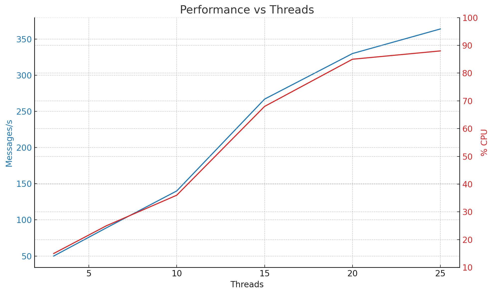

# Benchmark Modules for Platform and Framework Evaluation

## Overview

This Git repository serves as a centralized collection of **benchmarking modules** designed to evaluate the performance of various platforms, technologies, and software frameworks. Each module is self-contained and focuses on a specific technology stack or platform characteristic. The primary goal is to provide reproducible, comparative insights into system behavior under defined workloads or operations.

## Structure and Organization

The repository is organized into individual module directories. Each module includes:

* **Benchmark Code**: The actual implementation used to conduct the test.
* **Requirements File**: A list of dependencies or setup instructions specific to that module.
* **Benchmark Results**: Recorded performance outputs from past runs.
* **Standings and Summaries**: A record of results, typically ranked or summarized for comparative analysis.

This structure allows independent development, testing, and execution of each module, promoting modularity and ease of contribution.

## Purpose and Goals

The repository supports the following objectives:

* **Platform Evaluation**: Test and compare different operating systems, hardware environments, or cloud service providers under identical workloads.
* **Technology Comparison**: Benchmark performance across languages, runtimes, or frameworks (e.g., comparing Node.js vs Go for I/O performance).
* **Regression Monitoring**: Track performance changes across software versions or infrastructure updates.
* **Collaboration and Reproducibility**: Enable team members or external contributors to run identical tests in their environments for validation or extension.

## Usage

1. **Clone the Repository**
   Clone the repository and navigate to the desired module directory.

2. **Install Requirements**
   Each module includes a `requirements.txt`, `package.json`, or equivalent file. Follow the setup instructions provided to configure the environment.

3. **Run Benchmarks**
   Execute the benchmark script(s) provided in the module to produce current performance results.

4. **Review Existing Results**
   Historical outputs and standings are stored alongside each module for comparison.

5. **Submit a New Technology or Framework**

   * Choose an existing module relevant to the domain you want to benchmark (e.g., async I/O, file processing).
   * Review the module’s requirements and operational goals.
   * Implement your own version of the benchmark using the new technology or framework of interest.
   * Save your implementation and results in a new subdirectory within the module.
   * Update the module's standings with your performance metrics and submit a pull request for review.

## Contribution

Contributors are encouraged to:

* Add new modules for untested platforms or performance characteristics
* Extend existing modules with additional implementations
* Keep results up to date with new test runs and environments
* Document any noteworthy observations or edge cases discovered during benchmarking

# Results
## Async Message Service
### Kotlin, @Async and Java Threads

* 25 threads
* 88% CPU
* 372 messages per second

I stopped at 88% CPU just to have a stake in the ground. Show me how much faster you can get and I'll push it harder!

